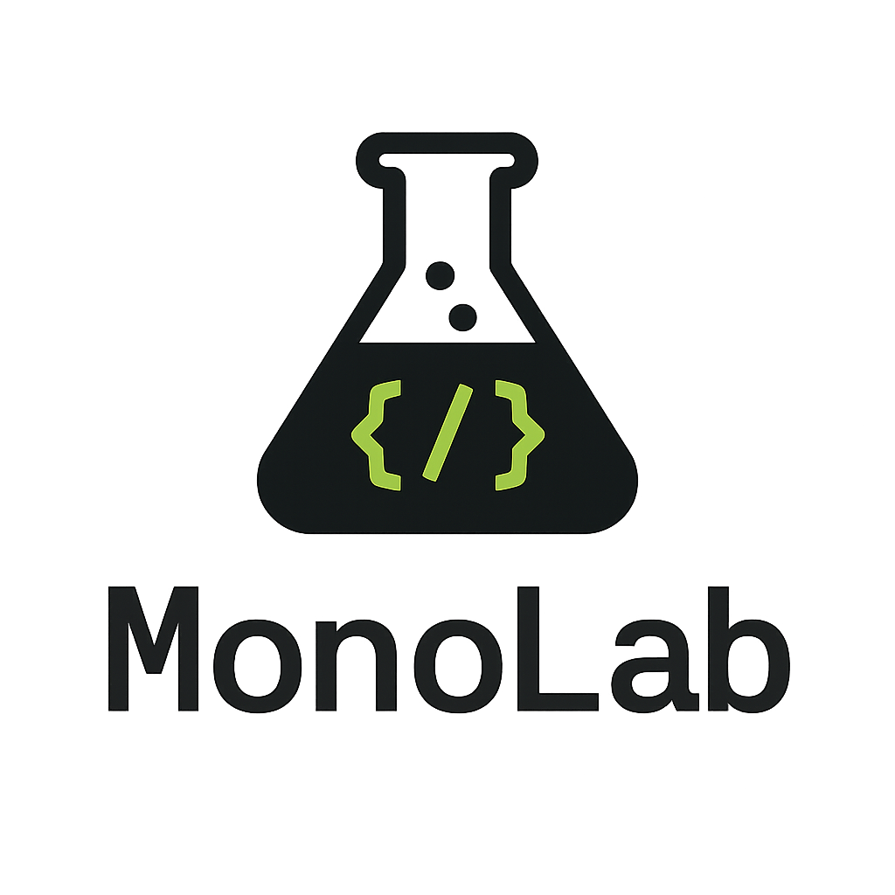

<!-- markdownlint-disable MD041 -->


[](https://github.com/pabloimrik17/monolab/actions/workflows/ci.yml)
[](https://github.com/pabloimrik17/monolab/actions/workflows/ci.yml)
[](https://codecov.io/gh/pabloimrik17/monolab)
[](https://dashboard.stryker-mutator.io/reports/github.com/pabloimrik17/monolab/develop)
[](https://opensource.org/licenses/MIT)
[](https://nx.dev)
[](https://nx.app/)
[](https://nodejs.org)
[](https://pnpm.io/)

[](https://github.com/pabloimrik17/monolab)

<!-- markdownlint-enable MD041 -->

## Development Setup

### Node.js Installation

This project uses Node.js version 22.21.0. To install and use this specific version:

<!-- markdownlint-disable MD013 MD029 -->

1. Make sure you have [nvm (Node Version Manager)](https://github.com/nvm-sh/nvm) installed
2. Clone the repository and navigate to the project directory
3. Run the following command to install and use the correct Node.js version:
 <!-- markdownlint-enable MD013 MD029 -->

```bash
nvm use
```

This will automatically read the `.nvmrc` file and switch to Node.js version 22.21.0.

### Package Manager Setup

<!-- markdownlint-disable MD013 MD029 -->

This project uses pnpm as the package manager. To activate pnpm version 10.13.1 using corepack:

1. Make sure you have corepack enabled:

```bash
corepack enable
```

2. Activate pnpm version 10.13.1:

```bash
corepack prepare pnpm@10.13.1 --activate
```

3. Verify the installation:
 <!-- markdownlint-enable MD013 MD029 -->

```bash
pnpm --version
```

The output should be `10.13.1`.

## Quality & Testing

### Mutation Testing

<!-- markdownlint-disable MD013 -->

[](https://dashboard.stryker-mutator.io/reports/github.com/pabloimrik17/monolab/develop)

<!-- markdownlint-enable MD013 -->

This project uses [Stryker Mutator](https://stryker-mutator.io/) for mutation
testing to validate the quality of our test suites. Mutation testing introduces
deliberate bugs (mutations) into the code and verifies that tests fail
appropriately, ensuring tests actually catch bugs beyond just achieving code
coverage.

#### Available Commands

Run mutation testing on all packages:

```bash
pnpm exec nx run-many -t test:mutation
```

Run mutation testing on affected packages only:

```bash
pnpm exec nx affected -t test:mutation
```

Run mutation testing on a specific package:

```bash
pnpm exec nx run @monolab/is-odd:test:mutation
```

View HTML report for a package:

```bash
pnpm exec nx run @monolab/is-odd:test:mutation:report
```

#### Mutation Score Interpretation

Mutation scores indicate the percentage of mutations that were detected
(killed) by tests:

-   **High (80-100%)**: Excellent test quality, most edge cases covered
-   **Medium (60-79%)**: Good test quality, some improvements possible
-   **Low (0-59%)**: Weak test quality, significant gaps in test coverage

Each package has graduated thresholds based on complexity:

-   **Utilities** (is-odd, is-even): 90% high / 75% low / 75% break
-   **React packages** (react-hooks, react-clean): 80% high / 65% low / 60% break
-   **Config packages** (ts-configs): 70% high / 50% low / 50% break

#### CI Behavior

Mutation testing runs automatically in CI with the following behavior:

<!-- markdownlint-disable MD013 -->

-   **Execution**: Only on push to `main` or `develop` branches (skipped on PRs)
-   **Incremental Mode**: Reuses results from previous runs to minimize execution
    time
-   **Caching**: Incremental cache is restored/saved with multi-level fallback
    strategy
-   **Dashboard**: Results are uploaded to
    [Stryker Dashboard](https://dashboard.stryker-mutator.io/reports/github.com/pabloimrik17/monolab/develop)
    for historical tracking
-   **Artifacts**: Mutation reports are uploaded as CI artifacts for 30 days

<!-- markdownlint-enable MD013 -->

#### Local Development

First run initializes the incremental cache and may take 10-30 minutes per
package. Subsequent runs reuse the cache and only test changed code,
significantly reducing execution time.

Reports are generated at `packages/*/reports/mutation/index.html` and can be
viewed in your browser.
